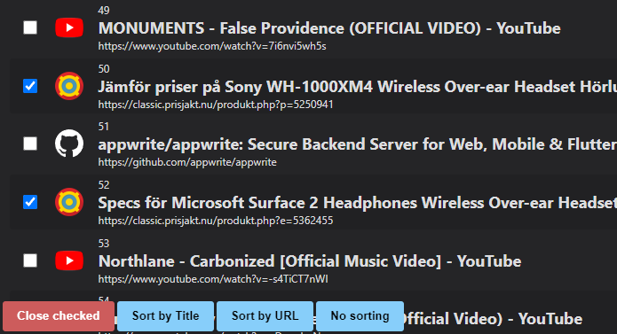

# tabs-overview
A bare minimum Chrome extension where you can select tabs to close.

Opens in a new tab.

## Developing

To load the folder as an extension in Chrome, got to [chrome://extensions/](chrome://extensions/), press *Load unpacked*, and select the `src` folder. You need to be in developer mode to do that.

## Misc

There were bigger plans for this but it's not really needed. 

There's no planned release on the Chrome Web Store at this point.